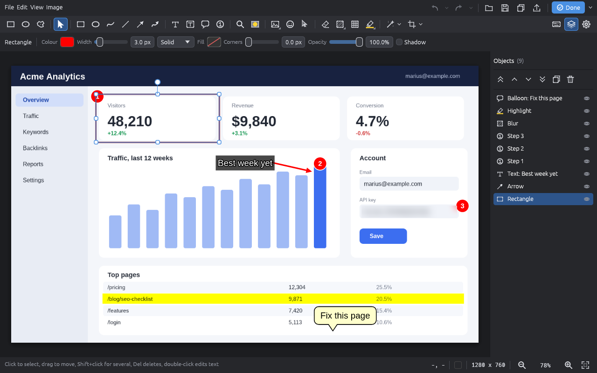

# ssx-editor-ui

The image-editor **window** of ssx: an egui/eframe application that drives
[`ssx_editor::EditorSession`](../ssx-editor). Toolbar, properties bar, canvas, object list, dialogs,
status bar. Library entry `run(EditorRequest) -> EditorOutcome` and the binary `ssx-editor-ui`.



*(Real window, captured under Xvfb on the Vulkan software rasteriser; the annotations were drawn with the
real tools and saved as an `.ssxe` project, which is what is open here.)*

## Using it

```
ssx-editor-ui [INPUT] [--output PATH] [--json]
```

* `INPUT`: an image (png/jpg/webp/bmp/gif) or an `.ssxe` project. Omitted: edit the clipboard image.
* `--output PATH` puts the editor in *workflow mode*: **Save** and **Done** write the edited PNG there
  (format by extension) instead of asking for a path. Without it nothing is ever overwritten silently:
  saving an opened image asks for a name (`<name>-edited.png` is suggested).
* `--json` prints the outcome on stdout: `{"action":"save"|"copy"|"upload"|"cancel","path":...}`.
  Exit code `0` = the user kept something, `3` = cancelled, `2` = could not start (bad file, no clipboard image).
* `Done` menu: *Save and close*, *Copy and close* (clipboard via `arboard`, plus the PNG when `--output` is set),
  *Upload and close* (writes the PNG, prints `upload`; **the caller uploads**), *Cancel*. Closing the window
  with unsaved changes asks first; closing after a save reports that save.

`F1` shows the shortcut cheat sheet (generated from the same table the key handler uses, see
`src/shortcuts.rs`). Tool letters: `V` select, `C` crop, `R` rectangle, `E` ellipse, `P` pen, `L` line,
`A` arrow (`Shift+A` freehand arrow), `T` text (`Shift+T` with outline/background), `B` balloon,
`N` step number, `M` magnify, `S` spotlight, `I` image, `J` sticker, `K` cursor, `X` eraser, `U` blur
(`Shift+U` pixelate), `G` grid, `H` highlighter. `Ctrl+Z/Y/C/V/S/O/D/A/G`, `Del`, arrows (Shift = 10 px), `Esc`,
`Enter`, `Ctrl+0/1/+/-` zoom, `Ctrl+L` object list.

Canvas: wheel = zoom about the pointer (touchpads pan, `Ctrl`+wheel/pinch zoom), middle-drag or `Space`+drag
pans, checkerboard behind transparency, pixel grid from 800 %, status bar with pointer coordinates, the colour
under the pointer, image size and zoom controls. Drag an image file onto the window to open it (hold `Shift`
to insert it as an object). Window size, the last tool, per-tool styles and recent colours are remembered in
`editor-ui.json` inside the ssx config directory (`SSX_CONFIG_DIR` overrides it).

## Architecture

Everything that is not pure drawing is testable without a display:

| Module | Role |
|---|---|
| `viewport` | zoom/pan maths in physical pixels (zoom about cursor keeps the point fixed, fit, loose clamp); unit + property tests |
| `tiles` | which 512 px tiles of the zoomed picture need (re)rendering, dirty-rectangle bookkeeping, eviction; unit + property tests |
| `keymap`, `shortcuts` | key routing (app / session / nobody; text editing wins) and the one shortcut table |
| `state` (`AppState`) | tool, open dialog, action queue, toasts, prefs; `action` is the command vocabulary |
| `props`, `forms`, `effects`, `history_log`, `export`, `prefs` | properties-bar model, dialog forms, effect catalogue, undo labels, encoders, state file |
| `document` (`EditorDoc`) | session + file names + exact dirty tracking (undo back to the saved state is clean again) |
| `preview` | live effect preview on a worker thread (coalescing requests) |
| `app` (`EditorApp`) | wires it together; `apply(Action)` needs no display |
| `icons`, `ui::*` | vector icons in code (ear-clipped concave fills, unit-tested to render non-empty) and the egui drawing |

**Rendering.** The canvas never renders the whole document. It asks the engine for 512 px tiles covering the
visible viewport at the current zoom in *physical* pixels (so HiDPI is crisp and a tile is blitted 1:1) and
repaints only the engine's dirty rectangles inside them with `TextureHandle::set_partial`. Work is budgeted per
frame (14 ms) and centre-first; while a zoom change re-renders, the old tiles are drawn scaled underneath so
software rendering never shows a blank canvas. Pointer events are consumed in order, so freehand strokes follow
every sample; text goes through `text_insert`, IME pre-edit/commit through `ime_preedit`/`text_insert`, and the
IME candidate window is anchored at the caret via `PlatformOutput::ime`.

## Backend decision

**eframe with the `wgpu` renderer**, default backends. `glow` is not built. Reasons: `egui_kittest`'s snapshot
renderer is wgpu, so the tests exercise the same renderer the app ships; wgpu runs on Vulkan/DX12/Metal and, on
machines without a GPU, on lavapipe. Verified here (all with the software rasteriser):

| Environment | Result |
|---|---|
| Xvfb + lavapipe (`WGPU_BACKEND=vulkan`) | starts, paints, draws/undo/type/save via `xdotool`, exits cleanly (`tests/xvfb.rs`) |
| Xvfb with no backend variables | starts (falls back to GL/llvmpipe through EGL) |
| headless sway (`WLR_BACKENDS=headless WLR_RENDERER=pixman`, Wayland, `WGPU_BACKEND=vulkan`) | starts, paints the image, sway's `kill` closes it through the normal close-request path (exit 3) |
| `cargo check --target x86_64-pc-windows-msvc` / `aarch64-apple-darwin` | compiles (not run) |

Native file dialogs use `rfd` (xdg-portal on Linux) on a worker thread. The *Save as* dialog has its own path
field, format and quality controls and a **Browse...** button, so saving works without a portal.

## Tests

`cargo test -p ssx-editor-ui`:

* unit and property tests in every module;
* `tests/ui.rs`, `tests/canvas.rs`: the **real window** driven through egui events (`egui_kittest`): toolbar
  clicks, drags that draw rectangles/arrows/blur/text/steps..., Shift/Alt/Ctrl modifiers, undo/redo, zoom/pan,
  eyedropper, dialogs, save/copy/done outcomes, unsaved prompt, drag-and-drop, partial rendering of a 4K image,
  HiDPI at 2x, snap guides, checkerboard, pixel grid; assertions are on the resulting `Document`;
* `tests/snapshots.rs`: golden PNGs in `tests/snapshots/` (toolbar, properties bars, full annotated window,
  selection + object list, dialog, effect preview, text editing). Tolerance-based; regenerate with
  `UPDATE_SNAPSHOTS=1 cargo test -p ssx-editor-ui --test snapshots`. Needs a Vulkan driver (lavapipe is fine);
* `tests/xvfb.rs`: the real binary under Xvfb + lavapipe with `xdotool` and `import`; **skips with a printed
  reason** when Xvfb, xdotool, ImageMagick or lavapipe is missing;
* `SSX_UI_DUMP=dir cargo test -p ssx-editor-ui --test look` writes PNGs of several states for eyeballing.

## Performance

Measured with the hidden `--bench pan-zoom|objects` flag (frame period, i.e. everything: tile rendering, egui
tessellation, upload, present) on **lavapipe in Xvfb, 1280x800 window, 3840x2160 image**, workspace crates at
opt-level 3. Software rasterisation makes these pessimistic; the engine's own share is the second row.

| Workload | frame mean | p50 | p95 | max | engine render / frame (mean) |
|---|---|---|---|---|---|
| zoom in/out and pan a 4K image (124 frames) | 29-38 ms | 32-37 ms | 39-53 ms | 43-62 ms | 11.5 ms |
| draw 100 objects (rect/ellipse/arrow/line/step/blur) on the 4K image, then pan/zoom (144 frames) | 27-39 ms | 19-33 ms | 55-75 ms | 69-88 ms | 9 ms |

(Two runs each; the range is run-to-run variation.) Initial paint at 100 % renders 2.5 megapixels of the 8.3 MP
image (the tiles covering the view); a small edit re-renders only its dirty rectangle (asserted in `tests/canvas.rs`).

## Known gaps

* The object list reorders with buttons (front/forward/backward/back), not by dragging rows.
* Emoji are the engine's built-in vector stickers plus monochrome symbols the bundled font covers; colour emoji
  need an engine change (documented in `ssx-editor`).
* The font picker offers only the bundled Liberation Sans (the engine's guarantee for identical output).
* The cut-out tool cuts along the dominant drag axis; the dialog offers exact numbers.
* On X11 the clipboard image is only served while the editor runs (no clipboard manager assumed); with
  `--output` the caller can copy from the written PNG.
* Printing is not implemented. "Pin to screen" belongs to the shell.
* Not verified live: Windows and macOS (compile-checked only), real GPUs, real IME engines (the IME event path
  is unit-tested with synthetic egui `Ime` events), pen pressure (touch force is forwarded to the session, which
  currently ignores pressure), high-DPI fractional scale factors other than 1 and 2.
* Engine wishes: `History` could expose entry labels (the UI keeps a parallel list, `history_log`), and a
  `Document::set_document`-style entry point would let "Apply effect" commit a precomputed document without a
  closure through `global_op`.
