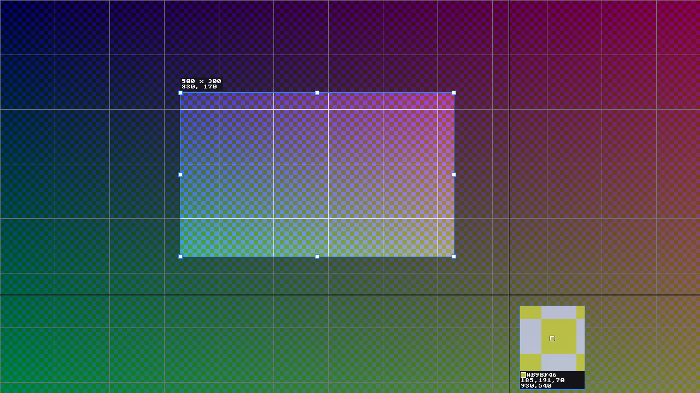

# ssx-overlay

The ShareX-style **frozen-screen region selection overlay** of ssx: the whole desktop is
frozen, dimmed, and you drag a rectangle (or ellipse, freeform outline, window or monitor) on
it. Library plus the helper binary `ssx-overlay`.



```rust
let outcome = ssx_overlay::select_via_helper(&input, Path::new("ssx-overlay"))?;   // recommended
let outcome = ssx_overlay::select(input)?;                                         // same code, in-process
match outcome {
    OverlayOutcome::Selected(sel) => sel.rect,      // + sel.shape (Rect | Ellipse | Freeform(polygon)) + sel.mask()
    OverlayOutcome::Window(w) | OverlayOutcome::Monitor(m) | OverlayOutcome::ColorPicked(c) | OverlayOutcome::Cancelled => ..
}
```

`OverlayInput { desktop: Frame, monitors, windows, options }`. The frame is the whole virtual
desktop, 8-bit sRGB, already tone-mapped (an HDR frame is refused with an error that says so).
**Every coordinate in and out is a virtual-desktop physical pixel** (`ssx-types`), origin
possibly negative, exactly as `ssx-capture-wayland/docs/wayland-coordinates.md` defines it.

## Architecture (and why)

```
                +-----------------------------------------------+
 select_via_    | ssx-overlay helper process                    |
 helper() ----> |  protocol.rs  request JSON + frame via memfd  |
  (client)      |  runner.rs    ->  OverlayApp                  |
                |     model/    SelectionModel (pure) -> Scene  |
                |     model/damage  Scene diff -> dirty rects   |
                |     render/   Renderer (CPU, BGRA, pre-dimmed)|
                |  backend/     x11 | wayland | windows | stub  |
                +-----------------------------------------------+
```

* **Helper process.** The overlay runs in its own process (`ssx-overlay`, request on stdin,
  one JSON line on stdout). It never shares an event loop with the tray daemon; a crash, a
  compositor that refuses layer-shell, or a wedged grab is contained and reported
  (`HelperError::Crashed/Timeout/Reported`); the client kills the helper on drop or timeout,
  so nothing can leave a full-screen window behind. All X11/Wayland quirks (grabs, exclusive
  keyboard interactivity, focus) live in a process that exists for about a second.
  `select()` is the *same* code path the helper runs.
* **Zero-extra-copy hand-off.** The client writes the frozen frame once into a sealed
  `memfd` (a private temp file on Windows/macOS); the helper maps it read-only and the
  renderer reads it once, converting to BGRA, forcing opaque alpha and pre-dimming in the
  same multi-threaded pass. JSON carries only the description.
* **Pure model.** All hit-testing, geometry and the interaction state machine live in
  `model/` and know nothing about windows, clocks (backends pass timestamps) or pixels:
  `SelectionModel::handle(InputEvent)` in, `Scene` (plain data) out. Two scenes are diffed
  into dirty rectangles by `model::damage`.
* **CPU renderer, integer only.** Everything expensive happens once at start-up; a redraw
  copies the dimmed background for the dirty rectangle, copies the bright pixels inside the
  selection, and draws the few overlays (border, handles, guides, label, loupe) into a small
  scratch canvas. Drag redraw cost is proportional to the *dirty* area.
  *Deviation from the brief:* `softbuffer` + `tiny-skia` were evaluated and dropped.
  `softbuffer` needs a `winit` window and cannot express override-redirect, layer-shell or
  our own `wl_shm` double-buffering; and tiny-skia's anti-aliased rasteriser clips paths
  against the target rectangle, so a pixel's value depended on *which dirty rectangle it was
  rendered in* (the damage property tests showed stray +-10 level pixels). Integer
  rasterisation makes "incremental render == full render" hold bit for bit, and for ellipse and
  freeform selections the bright pixels are exactly the pixels of the returned `mask()`.
  Text is the public-domain 8x8 bitmap font (`font8x8`) at integer magnification, which also
  makes the golden images deterministic.
* **Backends chosen at run time from what the session offers** (`backend/plan.rs`, pure and
  fixture-tested), not from the desktop's name:

  | session | backend |
  |---|---|
  | Wayland + `zwlr_layer_shell_v1` (sway, Hyprland, KWin) | layer `overlay`, anchored to all edges, exclusive keyboard, one surface per output |
  | Wayland, `xdg_wm_base` only (GNOME/Mutter) | one fullscreen `xdg_toplevel` per output, `set_fullscreen(wl_output)` |
  | X11 (or Wayland probing failed and `DISPLAY` is set) | one override-redirect window over the virtual desktop, pointer and keyboard grabbed |
  | Windows | one topmost `WS_POPUP` over the virtual desktop, per-monitor DPI v2 |
  | macOS | `OverlayError::Unsupported` stub (compiles; NSWindow overlay not written yet) |

  Native Wayland is preferred over XWayland (an override-redirect window under XWayland only
  covers X clients). `OverlayOptions::backend` and the fallthrough on *setup* failures
  (never on runtime failures: the user would see two overlays) are covered by tests.
  Fractional/mixed scales: buffers are in *desktop pixels* (>= native resolution by the
  capture crate's model) and `wp_viewporter` maps them onto the surface's logical size, so no
  per-output scale maths and no resampling on our side (`wp_fractional_scale` would only tell
  us a buffer size we already know). Pointer mapping is `Monitor.rect.size / surface logical
  size` (`mapping.rs`), which also lets an implicit-grab drag run past an output edge onto the
  next output.

## Interaction

| Input | Effect |
|---|---|
| move | crosshair guides through the pointer pixel, loupe (zoomed pixels, centre marker, `#RRGGBB`, `R,G,B`, `x,y`), hover highlight of the window under the pointer (front-most, minimized ignored, clipped to the desktop) |
| click on a highlighted window | selects and confirms its exact `WindowInfo.rect` (`Selection::snapped_window` is set) |
| drag | new rectangle; a plain click never destroys an existing selection (drag threshold 4 px) |
| drag a handle / the body | resize (8 handles; edges may cross, rectangle flips) / move (clamped to the desktop) |
| `Shift` while dragging | square (create), aspect-locked (corner resize) |
| `Space` or `Alt` while dragging | move the rectangle instead of resizing |
| `Ctrl` | snap edges to window / monitor / desktop edges within 8 UI px |
| arrows / `Shift`+arrows | nudge selection 1 px / 10 px; `Ctrl`+arrows resize the right/bottom edge |
| `Enter`, double-click inside | confirm (Enter over a highlighted window confirms it) |
| `Esc` | cancel |
| right-click | clears the selection; on an empty overlay cancels (ShareX behaviour) |
| wheel | loupe zoom 2..24 |
| `Tab` / `Shift+Tab` | cycle monitors: selects the whole monitor (monitor mode: moves the highlight) |
| `C` | end with `OverlayOutcome::ColorPicked` (`allow_color_pick`) |

Modes (`SelectMode`): `Rect`, `Ellipse` (bounding box + inscribed-ellipse mask), `Freeform`
(press-drag-release, returns the polygon and its bounding rect), `Monitor`, `Window`.
Rectangles are corner coordinates (x=10 to x=30 is 20 wide) and the last pixel row/column of
the desktop counts as the desktop edge, so the bottom-right pixel can be included.

## Verification

Run here (Linux container): `cargo test -p ssx-overlay` (115 unit/property, 21 live Xvfb, 7
live sway, 2 timing), `cargo clippy -p ssx-overlay --all-targets` (zero warnings, also
with `--target x86_64-pc-windows-msvc` and `aarch64-apple-darwin`), `cargo fmt`.

| Area | How it was verified |
|---|---|
| State machine, geometry, snapping, damage | unit + `proptest` (random event streams keep invariants; drag/nudge properties; `subtract`/`coalesce` exact) |
| Renderer | 7 golden PNGs (`tests/golden`, tolerance 2 levels on <0.05% of values; `UPDATE_GOLDEN=1` regenerates); property: *incremental dirty-rect render == full render* for rect, ellipse (HiDPI), freeform, window and monitor sessions |
| X11 | **live**: real helper process on private Xvfb driven by `xdotool`: exact rectangles for drags in every direction, double-click, Esc, right-click twice, nudge, Shift-square, hover snap, window/monitor/ellipse/freeform modes, colour pick, `initial`, frame origin offset, timeout, screenshot of the root window (dimmed exactly 50 %, selection pixel-exact, guides), crash/timeout/garbage helper handling, in-process `select()` |
| Wayland layer-shell | **live**: headless sway (pixman) with `zwlr_virtual_pointer_v1` + `zwp_virtual_keyboard_v1` injected by a test client and `grim` as an independent check that *each output* shows its slice of the frozen desktop dimmed; two outputs with a gap, drag continuing across outputs, mixed-scale (S=2) layout from the coordinate doc, monitor mode + Tab, keys, colour pick, snap, timeout |
| Wayland fullscreen (GNOME path) | **live** on sway (which implements `xdg_shell` fullscreen); Mutter itself not available |
| Backend planning | fixtures with the advertised globals of sway, Hyprland, KWin and Mutter |
| Windows | **compile-checked only** (`cargo check/clippy --target x86_64-pc-windows-msvc`); pure input decoding unit-tested; `tests/windows_manual.rs` is an `#[ignore]` manual test |
| macOS | compiles (`aarch64-apple-darwin`), returns `Unsupported` |
| GNOME, KDE, Hyprland | **not testable here**: implemented to protocol spec, selection logic fixture-tested, manual checklist below |

### Performance (release build, 4-core container, 3840x2160)

`cargo run --release -p ssx-overlay --example bench` (CPU only, presentation excluded):

| operation | result |
|---|---|
| ingest: convert to BGRA + pre-dim 33 MB | 13-25 ms |
| first full-desktop render | 20 ms |
| idle pointer (guides + loupe) | 0.23 ms/frame (~4300 fps) |
| drag a rectangle to ~full screen | 0.42 ms/frame (~2400 fps) |
| move a full-screen selection | 0.33 ms/frame (~3000 fps) |
| drag an ellipse to ~full screen | 2.9 ms avg, 6.9 ms p95 (~340 fps) |
| freeform stroke (400 points) | 1.4 ms avg (~730 fps) |

End-to-end start-up of the helper (`cargo test --release -p ssx-overlay --test perf -- --nocapture`,
median of 5, times measured from the helper's `main`):

| backend, 4K | client memfd write | helper ready (mapped, converted, pre-dimmed) | first frame presented |
|---|---|---|---|
| X11 on Xvfb (`PutImage` of 33 MB) | 15-20 ms | 30-45 ms | ~105 ms |
| Wayland layer-shell on headless sway (`wl_shm`) | (same) | ~27 ms | ~57 ms |

So the overlay is up roughly 75-125 ms after the call, of which the process spawn itself is
a few milliseconds. On X11 the remainder is the 33 MB `PutImage` through the server (MIT-SHM
would remove most of it; not done yet). Real GPU compositors add their own commit latency, and
presentation of *dirty rectangles* while dragging is proportional to their size (a
~160 000 px drag step is 0.6 MB).

## Manual verification checklists

Run `ssx-overlay --demo [WxH] [--mode rect|ellipse|freeform|monitor|window]` (synthetic
coordinate-coded desktop, prints the outcome as JSON) and check:

**Every platform**: overlay covers all monitors immediately, background dimmed, guides follow
the pointer, loupe shows the exact pixel under the centre marker with the right hex; drag
gives exact `W x H` and position; handles resize; Shift/Space/Ctrl behave; Enter confirms;
Esc cancels *without clicking first*; overlay disappears completely afterwards and the
desktop is interactive again; cancel via right-click; dragging across a monitor boundary.

* **GNOME/Mutter (Wayland)**: expect the fullscreen-toplevel path (`SSX_OVERLAY_LOG=debug`
  shows which backend). Check: one fullscreen window per monitor without titlebars or the
  top bar/dock showing over it; check that keyboard focus works immediately (Esc before any click)
  and after the first click; the crosshair cursor; mixed-DPI
  and fractional-scale (125 %, 150 %) layouts: drag from the left monitor to the right and
  compare the returned rectangle with a screenshot of the same region; the frozen frame
  aligns with what was on screen (no shift by the top bar). `XDG_SESSION_TYPE=x11` session:
  X11 backend.
* **KDE Plasma (Wayland)**: layer-shell path. Check the overlay covers panels/task bar,
  exclusive keyboard grab (Esc), fractional scaling, "Present Windows"/desktop-effects do not
  reveal live content over the frozen frame, multi-monitor with different scales.
* **Hyprland**: layer-shell path; check `windows` hover-snap rectangles (from
  `ssx-capture-wayland`) line up with the drawn highlight on a floating and a tiled window,
  multi-monitor with a scaled monitor, workspaces with a fullscreen client below the overlay.
* **sway** (verified live here, re-check on real hardware): the same as Hyprland, and a
  rotated (`transform 90`) output.
* **X11**: any WM plus a compositing one; check the window stays above panels and
  fullscreen games, grabs are released afterwards (click something), 4K and HiDPI
  (`Xft.dpi` 192: handle/text sizes follow `Monitor.scale_factor`), multi-head layouts with
  a monitor left of/above the primary.
* **Windows**: `cargo test -p ssx-overlay --test windows_manual -- --ignored --nocapture`;
  with two monitors at 100 % and 150-200 %: the overlay covers both, coordinates match a
  screenshot taken with the capture crate, UI element size follows the monitor under the pointer,
  the window takes keyboard focus even when started from a global hotkey (Alt-tap
  foreground trick), Esc works, a fullscreen video/game window stays covered, taskbar is
  covered, clipboard/Print-Screen unaffected afterwards.
* **macOS**: not implemented; expect `OverlayError::Unsupported`.

## Known limits

* `C`, like every letter, is matched by *physical position* on Wayland (`wl_keyboard.key`
  carries scancodes; layout-aware decoding would need xkbcommon). Esc/Enter/Tab/Space/arrows and
  modifiers are layout-independent; X11 and Windows decode real keysyms/virtual keys.
* Wayland compositors do not repeat keys for clients: arrow repeat is synthesised from
  `wl_keyboard.repeat_info`.
* Arrow keys nudge the *selection*; with no selection they do nothing (there is no portable
  pointer warp).
* Output hot-plug while the overlay is up is ignored; it lives for seconds.
* X11 needs a 32 bpp little-endian ZPixmap format (every current server).
* The Windows overlay is one window over the virtual desktop, not one per monitor:
  with per-monitor DPI v2 all coordinates are physical pixels, one buffer avoids seams and
  `WM_DPICHANGED` resizing, and UI scale follows the pointer's monitor in the model.
* An IME-composed input or accessibility tooling is out of scope.
